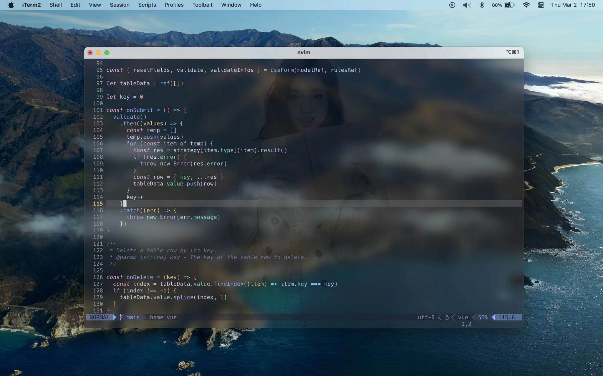
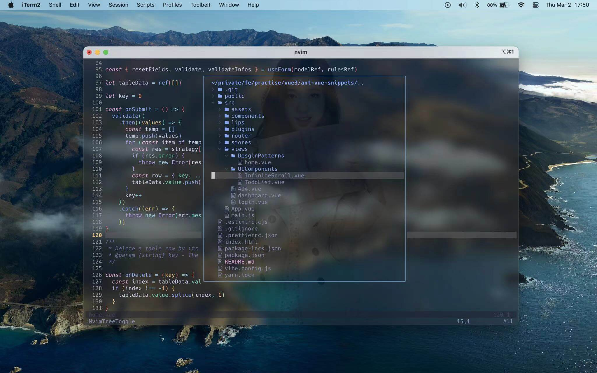
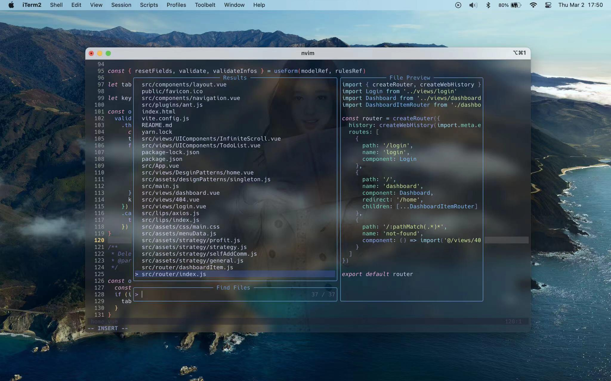

### Main window
 

#### Nvim-tree
 

#### Telescope
 

### Notes:
- neovim version: >= 0.8.0

Make sure your system has already installed below extensions. `Nerd Fonts` need to installed in your system it is for some plugins icon to display.

#### Mac OS:
``` bash
brew install gcc      # for treesitter
brew install ripgrep  # for telescope keymap <ledader>fg 
                      # to search for a string in your current working directory
```

### Linux (Debian/Ubuntu):
``` bash
apt install gcc
apt install ripgrep
```

#### Windows:
In Powershell, recommend use `scoop` package mananage.
``` bash
scoop install gcc
scoop install ripgrep
```

### Usage:
Just download this project into your `~/.config/` or replace `~/.config/nvim/` folder and then move to `lua/plugins/plugins-setup.lua` checkout this file and save it util all the plugins has been installing completed.
``` bash
git clone https://github.com/ejkgmea/neovim0to1.git   # rename to 'nvim'
```

### LSP Server
LSP sever is `coc.nvim`, so you need to run down below command line to install all of about your `coc.nvim` extensions after neovim plugin install completed.

``` bash
:CocInstall coc-tsserver coc-json coc-html coc-css coc-eslint coc-emmet
```

Nice keymaping, you can quickly moving your cursor to anywhere.
``` lua
vim.g.mapleader = ","

-- emmet-vim
vim.g.user_emmet_leader_key = ","

local keymap = vim.keymap

-------- normal model ----------
keymap.set("n", "0", "^")
keymap.set("n", "<leader>w", ":w!<cr>")
keymap.set("n", "<leader>a", "daw")

keymap.set("n", "<c-j>", "<c-w>j")
keymap.set("n", "<c-k>", "<c-w>k")
keymap.set("n", "<c-h>", "<c-w>h")
keymap.set("n", "<c-l>", "<c-w>l")

keymap.set("n", "<c-n>", ":bnext<cr>")
keymap.set("n", "<c-p>", ":bprevious<cr>")
keymap.set("n", "<leader>bd", ":Bdelete<cr>") -- close current buffer window
keymap.set("n", "<leader>nh", ":nohl<cr>")

-------- insert model ----------
keymap.set("i", "jk", "<esc>")
keymap.set("i", "kj", "<esc>") -- for macbook pro lower keyborad

-------- plugin keymap ----------
-- nvim-tree
keymap.set("n", "<leader>e", ":NvimTreeToggle<cr>")

```

More detail, checkout the plugins config file.

